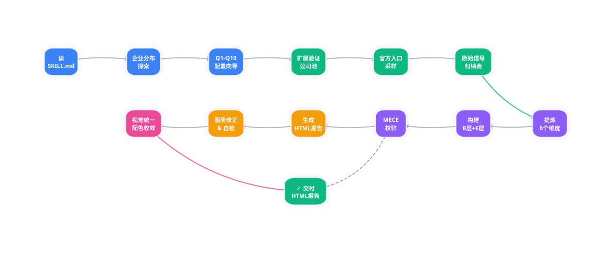

# TalentModel-skill

> 🎯 **Job Competency Modeling Tool** — Through an interactive config wizard, build a 3-tier competency model (Core Dimensions → Observable Behaviors → Role Evidence) based on candidate persona rather than a skills checklist. Outputs HTML reports with 4 visualizations.

📄 **中文版:** [README.md](README.md)

---

## 🤖 Agent Recommended Workflow

> 🤖 Recommended execution path for agents, from reading SKILL.md → generating & iterating HTML reports

**Live Preview (exportable as SVG/PNG):** [assets/agent-workflow.html](assets/agent-workflow.html)



---

## ⚡ For Agents & LLMs

> **Don't read this README. Load `SKILL.md` instead.**
>
> `SKILL.md` is the authoritative entry point. This file is human-facing documentation.

### How to use this skill

**Entry point:** `SKILL.md`

**Minimal invocation (chat):**
```
Use the TalentModel-skill. Target role: [role name], Level: [校招/实习/资深/管理], Scenario: [招聘/面试/晋升], Companies: [company A, company B, ...]
```

**Required config:**
| Parameter | Values | Notes |
|-----------|--------|-------|
| `ROLE_NAME` | any string | e.g. "AI Infra Engineer" |
| `TALENT_LEVEL` | `校招` / `实习` / `资深专家` / `管理者` | |
| `USE_CASE` | `招聘筛选` / `面试设计` / `晋升评估` | |
| `VALIDATION_COMPANIES` | 3–8 company names | Mix of types (big tech + vertical + traditional). See `test_cases/ENTERPRISE_REFERENCE.md` for valid options. |

**Optional config:**
| Parameter | Default | Notes |
|-----------|---------|-------|
| `OUTPUT_FORMAT` | `html` | HTML report with 4 charts |
| `SELF_CHECK_MATRIX` | `false` | 3-tier self-assessment table |
| `CHART_RENDER` | `offline` | echarts bundled locally |

**Key constraints you must follow:**
- **No radar/bar/line/pie charts.** Only `sunburst`, `treemap`, `scatter`, `tree`.
- **No quantitative values in charts.** No `value:` numbers, no axis `min/max`, no percentages — competence models have no measurement data.
- **3-level structure is mandatory.** Dimension → Observable Behavior → Evidence. Never skip levels or collapse them.
- **First-level dimensions must be human traits, not skills.** Dimensions like "system abstraction", "Python", or "hardware awareness" are forbidden as first-level. Behaviors (second-level) are where skills are anchored.
- **Campus/intern validation only for entry-level roles.** Never use senior/5yr+ JD to infer campus standards. Only use campus/graduate/intern job pages.
- **Verify before reporting.** Check the post-generation checklist in `SKILL.md` before returning the report.

**MCP integration (optional):**
If your agent harness supports MCP, add this to your `mcp.json`:
```json
{
  "mcpServers": {
    "talent-model": {
      "command": "npx",
      "args": ["-y", "@codebuddy/talent-model-mcp"]
    }
  }
}
```
Agents can then invoke the skill as a native MCP tool without reading SKILL.md directly.

**File layout:**
```
TalentModel-skill/
├── SKILL.md                        # ← Load this (entry point)
├── assets/
│   ├── echarts.min.js               # ECharts library (offline render)
│   ├── config_template.txt          # Config template
│   ├── agent-workflow.html          # Agent recommended workflow (exportable as SVG/PNG)
│   └── examples/                    # Example files
│       ├── ai_infra_campus.txt      # Sample conversation output
│       └── sunburst-comparison*.html # Chart comparison examples
└── references/                      # Reference docs (load as needed)
    ├── html_template.md              # HTML report template (CSS/JS)
    ├── enterprise_reference.md       # Valid company list by type
    └── test_cases.md                # Validation test suite
```

**Raw content URLs (fetch directly):**
- SKILL.md: `https://raw.githubusercontent.com/Liber1917/TalentModel-skill/master/SKILL.md`
- TEST_CASES: `https://raw.githubusercontent.com/Liber1917/TalentModel-skill/master/references/test_cases.md`
- ENTERPRISE_REFERENCE: `https://raw.githubusercontent.com/Liber1917/TalentModel-skill/master/references/enterprise_reference.md`
- HTML_TEMPLATE: `https://raw.githubusercontent.com/Liber1917/TalentModel-skill/master/references/html_template.md`

---

## Quick Start

### Download

```bash
git clone https://github.com/Liber1917/TalentModel-skill.git
```

### Install

Add `TalentModel-skill` to your agent's skills path:

```bash
# Method 1: Symlink
ln -s /path/to/TalentModel-skill <your-agent>/skills/talent-model

# Method 2: Copy
cp -r TalentModel-skill <your-agent>/skills/talent-model
```

### Usage

In an agent chat:

```
@talent-model
```

Or describe your request directly:

> "Build a competency model for an AI Infra engineer (campus hire)"

---

## Features

### Core Features

| Feature | Description |
|---------|-------------|
| 🎯 **Interactive Config Wizard** | 10-step guided config with smart hints and intent recognition |
| 📐 **MECE Structure Modeling** | 6-dimension competency framework, avoids skills-tree trap |
| ✅ **Official Website Validation** | Cross-validated against real job postings |
| 📊 **4 Visualizations** | Sunburst, Treemap, Scatter, Competency Tree |
| 🧭 **Talent Type Quadrant** | Identifies Potential / Baseline / Outstanding / Platform types |
| 📝 **Behavioral Anchor Table** | Observable behavior criteria |

### Optional Features

| Feature | Description | How to enable |
|---------|-------------|---------------|
| 📈 **Self-Assessment Matrix** | 3-tier comparison (🌱 Entry / ⚡ Baseline / 🔥 Outstanding) | Enable in config |
| 🖼️ **Chart Export** | PNG / SVG / JPEG | Hover to export |
| 📦 **Offline Rendering** | Bundled echarts.min.js, no network needed | Enable in config |

---

## Configuration

### Required Parameters

| Parameter | Description | Example |
|-----------|-------------|---------|
| `ROLE_NAME` | Target role name | AI Infra Engineer |
| `TALENT_LEVEL` | Talent level | 校招 / 实习 / 资深专家 / 管理者 |
| `USE_CASE` | Use case | 招聘筛选 / 面试设计 / 晋升评估 |
| `VALIDATION_COMPANIES` | Companies to validate against | OpenAI, NVIDIA, ByteDance... |

### Optional Parameters

| Parameter | Description | Default |
|-----------|-------------|---------|
| `OUTPUT_FORMAT` | Output format | `html` |
| `SELF_CHECK_MATRIX` | Self-assessment matrix | `false` |
| `CHART_RENDER` | Chart render mode | `offline` |

### Config Example

```
ROLE_NAME = AI Infra Engineer
TALENT_LEVEL = 校招
USE_CASE = 招聘筛选
VALIDATION_COMPANIES = OpenAI, NVIDIA, ByteDance, Alibaba Cloud
OUTPUT_FORMAT = html
SELF_CHECK_MATRIX = true
CHART_RENDER = offline
```

---

## HTML Report Usage

### File Description

When **HTML report** output is selected:

| File | Description | Required |
|------|-------------|---------|
| `{Role}_Competency_Model.html` | Main report | ✅ |
| `echarts.min.js` | ECharts library (offline mode) | Only in offline mode |

### Usage Steps

1. **Keep files in the same directory**
   ```
   workspace/
   ├── AI_Infra_Engineer_Competency_Model.html
   └── echarts.min.js          ← required in offline mode
   ```

2. **Open in browser**
   - Double-click or drag into browser
   - Works in Chrome, Edge, Firefox, Safari

3. **Export charts**
   - Hover over chart area
   - Export buttons appear top-right
   - PNG / SVG / JPEG supported

4. **Offline usage**
   - Report fully works without network
   - Charts render via local `echarts.min.js`

### Notes

- CDN mode requires network, but renders more clearly
- Offline mode produces larger files but is fully self-contained
- To share in offline mode, share both files together

---

## Changelog

### v1.1.0 (2026.04)

- 🛡️ Hard constraints for 6 failure modes (skill dimension trap, campus/senior JD boundary, chart type prohibition, chart quant hallucination, etc.)
- 📋 Post-generation self-check checklist
- ⚡ For Agents & LLMs section with MCP integration guide
- 🎨 ECharts config examples embedded in HTML template
- 🔍 ENTERPRISE_REFERENCE.md — 4-tier company taxonomy (big tech / mid-growth / vertical leaders / traditional)

### v1.0.0 (2026.04)

- 🎉 Initial release
- 🎯 Interactive config wizard
- 📐 MECE 6-dimension framework
- ✅ Official website validation
- 📊 4 visualizations (sunburst, treemap, scatter, tree)
- 🧭 Talent type quadrant + behavioral anchors
- 📈 Optional 3-tier self-assessment matrix
- 🖼️ Chart export (PNG / SVG / JPEG)
- 📦 Offline/CDN dual render mode

---

## Project Structure

```
TalentModel-skill/
├── SKILL.md                        # Skill entry point (Agent: read this)
├── README.md                       # Chinese documentation
├── README_en.md                    # English documentation
├── assets/                         # Static assets
│   ├── config_template.txt          # Configuration template
│   └── echarts.min.js               # ECharts library (offline rendering)
├── test_cases/                     # Validation tests
│   ├── TEST_CASES.md               # Test case configuration
│   ├── ENTERPRISE_REFERENCE.md      # Validation company reference (by type)
│   └── run_new_flow_test.py         # Automated test runner
└── examples/                       # Samples
    └── ai_infra_campus.txt          # Campus AI Infra role sample report
```

---

## Core Principles

> **A competency model is not a polished job description.**

> **It is a structured judgment of "what kind of person the organization really wants to identify."**

> **First model the person, then map behaviors, finally validate with evidence.**

---

## References

- [MECE Principle](https://en.wikipedia.org/wiki/MECE_principle) — Mutually Exclusive, Collectively Exhaustive
- [Behavioral Event Interview (BEI)](https://wiki.mbalib.com/wiki/%E8%A1%8C%E4%B8%BA%E4%BA%8B%E4%BB%B6%E8%AE%BF%E8%B0%88%E6%B3%95) — Primary tool for revealing competency characteristics (MBA智库百科)

---

## License

MIT
